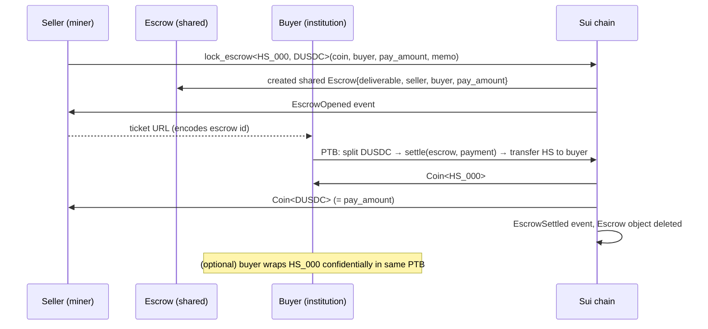

# Atomic OTC settlement for m1n3

> A peer-to-peer escrow that lets a miner sell `Coin<HS_NNN>` for
> `Coin<DUSDC>` in a single atomic PTB, with an honest path to
> confidential balances post-settle via
> [`MystenLabs/confidential-transfers`](https://github.com/MystenLabs/confidential-transfers).
> **Devnet only.**

## Status

This document is honest about what Phase A ships and what it does
not. Read the **What's confidential, what isn't** section carefully
before talking up the privacy story to a judge.

## Why an OTC route at all

The existing `hash_share_market` is a public CLOB: every fill emits a
`BuyOrderFilled` / `SellOrderFilled` event with the full notional
visible to every block explorer. That's fine for retail and discovery,
but it's the wrong shape for an industrial-scale miner unwinding a
position, or a market maker netting a multi-hour batch.

OTC desks (Genesis, Cumberland, FalconX) exist for those flows
specifically because they hide the print until the trade is done. On
chain you need an escrow primitive that lets two counterparties settle
atomically; layered on top of that you can add confidentiality.

## The full loop (intent)

Devnet is the only network where **m1n3**, **Hashi**, and
**confidential-transfers** all live. That coincidence underwrites the
institutional end-to-end story:

```text
1. Miner produces shares  →  mints Coin<HS_000>             (m1n3)
2. Miner ⇄ institution negotiate price off-chain
3. Miner lock_escrows Coin<HS_000> committing to (buyer, DUSDC price)
4. Institution signs one PTB → atomic settle:
   a. pays DUSDC to miner
   b. receives Coin<HS_000> from escrow
5. Institution optionally `contra::wrap`s the HS_000 into a
   confidential TokenAccount<HS_000>                        (NEW)
6. Round closes, block found, Hashi committee approves +
   confirms the deposit, HashiRewardBatch<BTC> is funded    (existing)
7. Institution unwraps their Coin<HS_000>
8. Institution calls hash_share::redeem<HS_000, BTC>        (existing)
   → receives Coin<BTC> proportional to their HashShare slice
```

## What's confidential, what isn't (read this)

| Surface | Phase A | Phase B (planned) |
|---|---|---|
| Escrow object trade size | **Public** (`(deliverable_amount, pay_amount)` are plaintext on the `Escrow` shared object) | Hidden behind a Pedersen commitment, with an NIZK equality proof binding the buyer's encrypted pay amount to the commitment |
| Pay-leg transfer to seller | **Public** (`Coin<DUSDC>` moved by value) | `contra::batched_transfer<DUSDC>` from buyer→seller; encrypted amount on chain |
| Deliverable transfer to buyer | **Public** (`Coin<HS_NNN>` returned from `settle`) | Optional same-PTB `contra::wrap<HS_NNN>` into buyer's confidential `TokenAccount` |
| Buyer's overall HashShare holdings | Public until they wrap | Confidential after wrap — what subsequent observers see is the encrypted balance, not the ungranulated history |
| Atomicity | **Yes** — single buyer-signed PTB; either both legs happen or neither | Same |

The **honest pitch for Phase A** is "atomic on-chain escrow + an
opt-in confidential wrap of the deliverable's resting balance". The
**dishonest pitch** would be "confidential OTC swap" — that's only
true at the post-wrap balance level, not at the trade-execution level.

The **why** behind Phase A's limited confidentiality: importing
`confidential-transfers` as a Move dep on devnet today hits a Sui
framework version-skew problem
(`sui::rangeproofs` / `dynamic_field::exists` API drift across
framework revs). The fix is upstream in either contra or our pin; we
chose to ship a working atomic escrow now and add the Move-level
confidential pay leg in Phase B.

## The Move escrow

The new package modules under `contracts/sources/`:

| Module | What |
|---|---|
| [`dusdc.move`](../contracts/sources/dusdc.move) | 6-decimal `DUSDC` coin we issue, with a permissionless `dusdc::faucet` for the demo. Stands in for the real DUSDC (which we can't `register_confidential` on without the issuer's TreasuryCap). |
| [`m1n3_confidential_otc.move`](../contracts/sources/m1n3_confidential_otc.move) | The `Escrow<DeliverableT, PayT>` shared object + `lock_escrow` / `settle` / `cancel` entrypoints. |

The atomicity model is the standard Sui escrow: seller locks the
deliverable into a shared object, buyer signs ONE PTB that hands the
escrow a `Coin<PayT>` worth `escrow.pay_amount` and receives the
deliverable. If the buyer's `Coin<PayT>` is short, the move call
aborts and the whole PTB reverts; the deliverable never leaves the
escrow.



## The three-state route

| State | Lives in | Behavior |
|---|---|---|
| **Draft** (seller) | [`OtcDraft.tsx`](../web/components/otc/OtcDraft.tsx) | Form: deliverable amount, DUSDC price, buyer address, memo. Signs the seller's `lock_escrow`; emits a share URL encoding the on-chain escrow id. |
| **Counter-sign** (buyer/seller) | [`OtcCounterSign.tsx`](../web/components/otc/OtcCounterSign.tsx) | Resolves the on-chain `Escrow` object. If the connected wallet is the buyer → settle button. If the seller → cancel button. |
| **Settle** | [`OtcSettlement.tsx`](../web/components/otc/OtcSettlement.tsx) | Receipt: SuiScan link, both legs displayed. |

Hooks: [`useOtcEscrow.ts`](../web/hooks/useOtcEscrow.ts) exports
`useEscrow`, `useLockEscrow`, `useSettleEscrow`, `useCancelEscrow`,
`useDusdcFaucet`. The page uses
`dynamic(..., { ssr: false })` because the confidential-transfers SDK
bundle (used elsewhere on the page tree for wrap helpers) can't be
prerendered under `output: 'export'`.

## Phase B (out of this PR)

- **Confidential pay leg.** Import `confidential-transfers` as a Move
  dep, swap the plaintext `Coin<PayT>` settle argument for a
  `contra::TransferBatch<PayT>`, and add a `nizk::DdhProof` to bind the
  encrypted amount to `escrow.pay_amount`. Settle becomes:
  ```move
  contra::finalize(batch);
  // ...release deliverable...
  ```
- **Hidden trade size.** Replace `pay_amount: u64` in the `Escrow`
  object with `pay_amount_commit: Element<G>` (Pedersen). The buyer's
  proof at settle time binds the encrypted amount to the commitment;
  the public `Escrow` reveals nothing.
- **On-chain confidential wrap of the deliverable.** Same-PTB
  `contra::wrap<DeliverableT>(receiver_account, deliverable, ...)` so
  the buyer's HS holdings start their life encrypted.
- **Walrus-backed ticket persistence.** Today the URL is the bearer
  credential; survives only as long as one party keeps the link.
  Walrus blob storage gives durable tickets.
- **Auditor compliance UI.** Optional registered auditor at confidential
  account creation; their view-key decrypts the trade for compliance
  review.

## Vendor + WASM toolchain (carried over from prior phase)

Even though we don't take a Move dep on confidential-transfers in
Phase A, the dapp still pulls the **TypeScript SDK** for the
optional post-settle confidential wrap. That SDK is vendored under
`web/vendor/confidential-transfers/` (gitignored) and built by
[`scripts/vendor-confidential-transfers.sh`](../scripts/vendor-confidential-transfers.sh).
Requirements: `wasm-pack` + a `wasm32-unknown-unknown`-capable C
compiler (`brew install llvm` on macOS — Apple clang can't target wasm).

## Devnet bring-up

Captured in `.env.devnet` (gitignored):

```text
SUI_PACKAGE=0xcb89aa2d…418a61e5499f077         # m1n3_v4 with OTC escrow + dusdc
HS_000_CAP_ID=0x5ba1e3e0…f6f4d                  # mint test HS to seller
DUSDC_CAP_ID=0x1b7d1727…d37a3                   # shared cap → dusdc::faucet
DUSDC_COIN_TYPE=0xcb89aa2d…::dusdc::DUSDC
CONFIDENTIAL_TRANSFERS_PACKAGE=0xe0f1b22e…d70c271  # contra (reference only)
HASHI_BTC_VAULT_ID=0x816808e9…84c810db              # Hashi devnet vault
```

The dapp reads these via `NEXT_PUBLIC_*` overrides; defaults pinned in
[`web/lib/confidential-constants.ts`](../web/lib/confidential-constants.ts).

## Demo script

1. Set `NEXT_PUBLIC_SUI_NETWORK=devnet` in `web/.env.local`.
2. Connect Wallet A (seller — the miner that minted `Coin<HS_000>`).
3. Open `/otc`. Set: deliver 100 HS_000, price 50 DUSDC, buyer = Wallet
   B address, memo "round 7 settlement".
4. Click **Lock escrow + share link**; sign one PTB. URL appears with
   the escrow object id.
5. Switch to Wallet B, open the URL. The page resolves the escrow and
   shows the trade.
6. Click **DUSDC faucet** if Wallet B needs DUSDC; one PTB mints 1000.
7. Click **Settle (atomic)** — one PTB pays the seller and delivers
   the HS to the buyer.
8. SuiScan view: `EscrowOpened` + `EscrowSettled` events, both `Coin`
   movements visible. The Escrow object is deleted.

## Watching Foundry on Polygon

Industrial-scale BTC miners' on-chain footprint is a live
intelligence feed for trading desks. Even the Phase A escrow narrows
that surface vs. the public market: a single shared `Escrow` per
trade with off-chain price negotiation beats a public order book
where every cancel + fill is observable. Phase B closes the gap to
"the trade size itself is a ciphertext".
